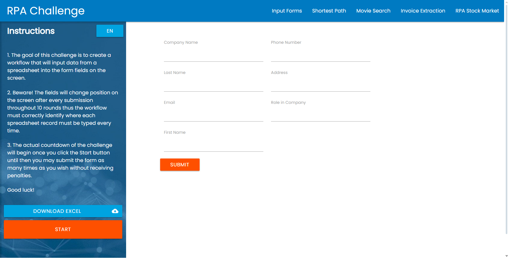

<div align="center">

# RPA Challenge


</div>



> Mini projeto destinado a um desafio proposto por um perfil no linkedin, o Objetivo é preencher um formulario de 10 pessoas extraindo os dados delas no arquivo **challenge.xlsx** presente na pasta **resources**

## 💻 Pré-requisitos

Para executar este projeto, as seguintes bibliotecas Python são necessárias:

- `selenium`: para o controle do browser
- `openpyxl`: para a coleta dos dados presentes no arquivo **challenge.xlsx**

## 🚀 Instalando as dependências

Você pode instalar todas as dependências executando:

Windows:

```
pip install -r requirements.txt
```

## ☕ Executando o RPA challenge

Para usar RPA challenge, siga estas etapas:

```
python bot.py
```

## 📫 Contribuindo para RPA challenge

Para contribuir com RPA challenge, siga estas etapas:

1. Bifurque este repositório.
2. Crie um branch: `git checkout -b <nome_branch>`.
3. Faça suas alterações e confirme-as: `git commit -m '<mensagem_commit>'`
4. Envie para o branch original: `git push origin RPA challenge / <local>`
5. Crie a solicitação de pull.

Como alternativa, consulte a documentação do GitHub em [como criar uma solicitação pull](https://help.github.com/en/github/collaborating-with-issues-and-pull-requests/creating-a-pull-request).


Desenvolvi uma automação como um desafio de uma postagem do linkdin. O objetivo da automação é o preenchimento automático de um formulário do site RPA Challenge.
Utilizei a linguagem python junto com duas bibliotecas, Selenium e openpyxl.

Etapas da Automação:
- Acessar o site RPA Challenge
- Clicar no botão start para iniciar a contagem de tempo do desafio.
- Preenche o formulário com os dados, pré-extraidos de uma planilha disponibilizada pelo site, por 10 rodadas.
- Após preencher o formulário com todos os dados o bot guarda a mensagem de parabenização. 
- Em seguida bot acessa o site [DontPad](https://dontpad.com/result_RPAChallenge)e guarda essa mensagem.
